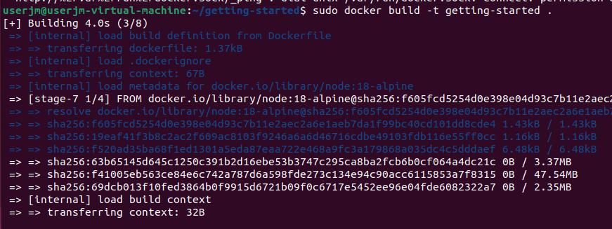

# Actividad 2 de Docker
## Lleva a cabo la práctica descrita en el primer artículo
### 1. Ejecuta la imagen "hello-world"

### 2. Muestra las imágenes Docker instaladas

### 3. Muestra los contenedores Docker

## Lleva a cabo la práctica descrita en el segundo artículo
### 1. Edita el fichero Dockerfile

### 2. Construye el contenedor

### 3. Ejecútalo

### 4. Create una cuenta en hub.docker.com

### 5. Publícalo

