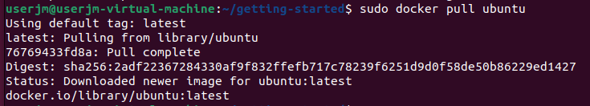
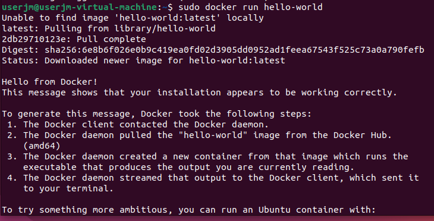
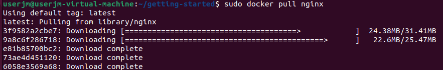
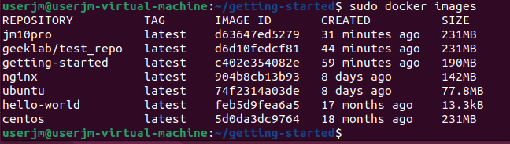
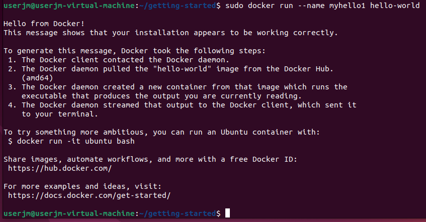
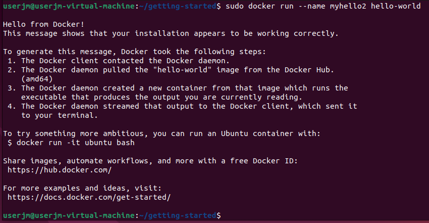
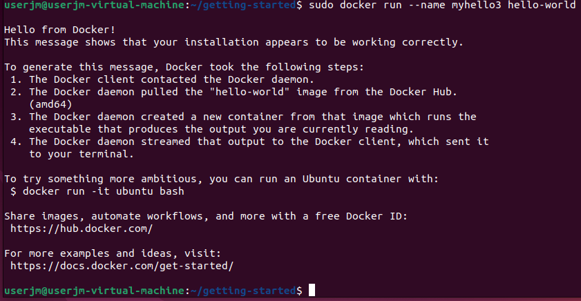
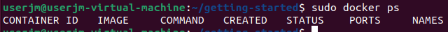

# Actividad 3 de Docker
## 1. Descarga la imagen de ubuntu


## 2. Descarga la imagen de hello-world


## 3. Descarga la imagen de nginx


## 4. Muestra un listado de todas la imágenes


## 5. Ejecuta un contenedor hello-world y dale nombre “myhello1”


## 6. Ejecuta un contenedor hello-world y dale nombre “myhello2”


## 7. Ejecuta un contenedor hello-world y dale nombre “myhello3”


## 8. Muestra los contenedores que se están ejecutando
```bash
sudo docker ps
```

## 9. Para el contenedor "myhello1”
```bash
sudo docker stop myhello1
```

## 10. Para el contenedor "myhello2”
```bash
sudo docker stop myhello2
```

## 11. Borra el contenedor “myhello1”
```bash
sudo docker rm myhello1
```

## 11. Muestra los contenedores que se están ejecutando.


## 12. Borra todos los contenedores
### Un comando muy útil para eliminar de golpe todos los contenedores primero hay que parar los que están ejetutándose, luego se eliminan:
```bash
sudo docker stop $(docker ps -a -q)
sudo docker rm $(docker ps -a -q)
```
### O también podemos indicar todos los nombres de los contenedores parados que queremos eliminar

