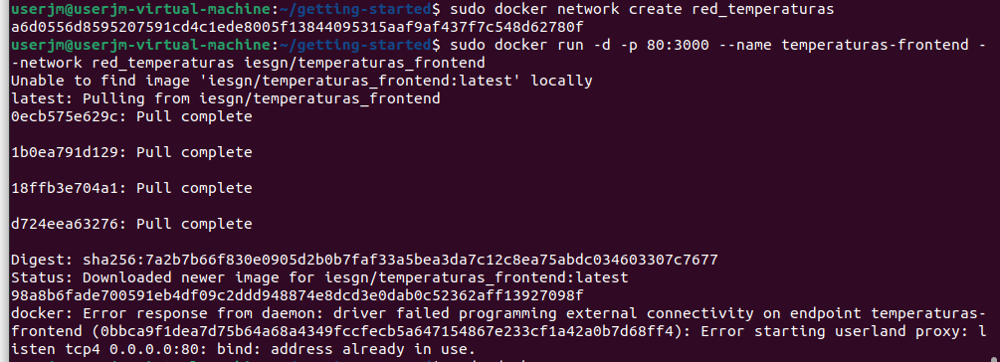

# Actividad 4 de Docker

## Ejemplo 1. Despliegue de Wordpress + mariadb
### Primero vamos a crear los contenedores en la misma red


## 2. Siguiendo la documentación de la imagen mariadb y la imagen wordpress podemos ejecutar los siguientes comandos para crear los dos contenedores
```bash
sudo docker run -d --name servidor_mysql \
                --network red_wp \
                -v /opt/mysql_wp:/var/lib/mysql \
                -e MYSQL_DATABASE=bd_wp \
                -e MYSQL_USER=user_wp \
                -e MYSQL_PASSWORD=asdasd \
                -e MYSQL_ROOT_PASSWORD=asdasd \
                mariadb
```
```bash
sudo docker run -d --name servidor_wp \
                --network red_wp \
                -v /opt/wordpress:/var/www/html/wp-content \
                -e WORDPRESS_DB_HOST=servidor_mysql \
                -e WORDPRESS_DB_USER=user_wp \
                -e WORDPRESS_DB_PASSWORD=asdasd \
                -e WORDPRESS_DB_NAME=bd_wp \
                -p 80:80 \
                wordpress
```


## Ejemplo 2. Despliegue de la aplicación Temperaturas

### Vamos a hacer un despliegue completo de una aplicación llamada Temperaturas. Esta aplicación nos permite consultar la temperatura mínima y máxima de todos los municipios de España. Esta aplicación está formada por dos microservicios:

* `frontend`: Es una aplicación escrita en Python que nos ofrece una página web para hacer las búsquedas y visualizar los resultados. Este microservicio hará peticiones HTTP al segundo microservicio para obtener la información. Este microservicio ofrece el servicio en el puerto 3000/tcp. Usaremos la imagen `iesgn/temperaturas_frontend`.
* `backend`: Es el segundo microservicio que nos ofrece un servicio web de tipo API Restful. A esta API Web podemos hacerles consultas sobre los municipios y sobre las temperaturas. En este caso, se utiliza el puerto 5000/tcp para ofrecer el servicio. Usaremos la imagen `iesgn/temperaturas_backend`.

El microservicio `frontend` se conecta a `backend` usando el nombre `temperaturas-backend`. Por lo tanto el contenedor con el micorservicio `backend` tendrá ese nombre para disponer de una resolución de nombres adecuada en el dns.

Vamos a crear una red para conectar los dos contenedores:

```bash
sudo docker network create red_temperaturas
```


Para ejecutar los contenedores:

```bash
sudo docker run -d --name temperaturas-backend --network red_temperaturas iesgn/temperaturas_backend

sudo docker run -d -p 80:3000 --name temperaturas-frontend --network red_temperaturas iesgn/temperaturas_frontend
```


Algunas observaciones:

* Este es un tipo de aplicación, que se caracteriza por no necesitar guardar información para su funcionamiento. Son las denominadas **aplicaciones sin estado**, por lo tanto no necesitamos almacenamiento adicional para la aplicación.
* No es necesario mapear el puerto de `backend`, ya que no vamos a acceder desde el exterior. Sin embargo el microservicio `frontend` va a poder acceder a `backend` al puerto 5000 porque están conectado a la misma red.
* Al nombrar al contenedor de backend con `temperaturas-backend` se crea una entrada en el DNS que resuelve ese nombre con la ip del contenedor. Como hemos indicado, por defecto, el microservicio `frontend` usa ese nombre para acceder.


## Ejemplo 3. Despliegue de la aplicación Guestbook

En este ejemplo vamos a desplegar una aplicación web que requiere de dos servicios (servicio web y servicio de base de datos) para su ejecución. La aplicación se llama GuestBook y necesita los dos siguientes servicios:

* La aplicación guestbook es una aplicación web desarrollada en python que es servida por el puerto 5000/tcp. Utilizaremos la imagen `iesgn/guestbook`.
* Esta aplicación guarda la información en una base de datos no relacional redis, que utiliza el puerto 6379/tcp para conectarnos. Usaremos la imagen `redis`.

**Volúmenes**

Si estudiamos la documentación de la imagen redis en [Docker Hub](https://hub.docker.com/_/redis), para que la información de la base de datos se guarde en un directorio `/data` del contenedor hay que ejecutar el proceso `redis-server` con los argumentos `--appendonly yes`.

**Redes**

La aplicación guestbook por defecto utiliza el nombre `redis` para conectarse a la base de datos, por lo tanto debemos nombrar al contenedor redis con ese nombre para que tengamos una resolución de nombres adecuada.

Los dos contenedores tienen que estar en la misma red y deben tener acceso por nombres (resolución DNS) ya que de principio no sabemos que ip va a coger cada contenedor. Por lo tanto vamos a crear los contenedores en la misma red:

```bash
$ docker network create red_guestbook
```


Para ejecutar los contenedores:

```bash
$ docker run -d --name redis --network red_guestbook -v /opt/redis:/data redis redis-server --appendonly yes


$ docker run -d -p 80:5000 --name guestbook --network red_guestbook iesgn/guestbook
```


Algunas observaciones:

* No es necesario mapear el puerto de `redis`, ya que no vamos a acceder desde el exterior. Sin embargo la aplicación `guestbook` va a poder acceder a la base de datos porque están conectado a la misma red.
* Al nombrar al contenedor de la base de datos con `redis` se crea una entrada en el DNS que resuelve ese nombre con la ip del contenedor. Como hemos indicado, por defecto, la aplicación guestbook usa ese nombre para acceder.
* Si eliminamos el contenedor de `redis` y lo volvemos a crear podemos comprobar la persistencia de la información.


