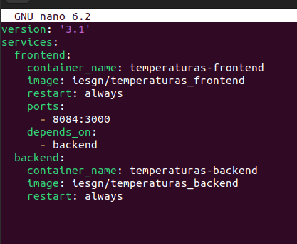
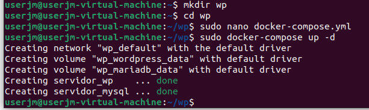

# Actividad 5 de Docker


## Ejemplo 1: Despliegue de la aplicación guestbook

### En este ejemplo vamos a desplegar con docker-compose la aplicación *guestbook*. 

#### Puedes encontrar el fichero `docker-compose.yml` en en este [directorio](https://github.com/josedom24/curso_docker_ies/tree/main/ejemplos/modulo4/ejemplo1) del repositorio. 

#### En el fichero `docker-compose.yml` vamos a definir el escenario. El programa `docker-compose` se debe ejecutar en el directorio donde este ese fichero. 


```yaml
version: '3.1'
services:
  app:
    container_name: guestbook
    image: iesgn/guestbook
    restart: always
    ports:
      - 80:5000
  db:
    container_name: redis
    image: redis
    restart: always
```


#### Para crear el escenario:


#### Ejecutamos este comando si no tenemos instalado `docker-compose`


```bash
sudo docker-compose up -d
Creating network "guestbook_default" with the default driver
Creating guestbook ... done
Creating redis     ... done
```


Para listar los contenedores:

```bash
sudo docker-compose ps
  Name                 Command               State          Ports        
-------------------------------------------------------------------------
guestbook   python3 app.py                   Up      0.0.0.0:80->5000/tcp
redis       docker-entrypoint.sh redis ...   Up      6379/tcp            
```


Para parar los contenedores:

```bash
sudo docker-compose stop 
Stopping guestbook    ... done
Stopping redis ... done
```

Para eliminar el escenario:

```bash
docker-compose down
Stopping guestbook ... done
Stopping redis     ... done
Removing guestbook ... done
Removing redis     ... done
Removing network guestbook_default
```


---

## Ejemplo 2: Despliegue de la aplicación Temperaturas

### En este ejemplo vamos a desplegar con docker-compose la aplicación *Temperaturas*.

#### Puedes encontrar el fichero `docker-compose.yml` en en este [directorio](https://github.com/josedom24/curso_docker_ies/tree/main/ejemplos/modulo4/ejemplo2) del repositorio. 


#### En este caso el fichero `docker-compose.yml` puede tener esta forma:

```yaml
version: '3.1'
services:
  frontend:
    container_name: temperaturas-frontend
    image: iesgn/temperaturas_frontend
    restart: always
    ports:
      - 80:3000
    depends_on:
      - backend
  backend:
    container_name: temperaturas-backend
    image: iesgn/temperaturas_backend
    restart: always
```



####  Para crear el escenario:

```bash
sudo docker-compose up -d
Creating network "temperaturas_default" with the default driver
Creating temperaturas-backend ... done
Creating temperaturas-frontend ... done

```


#### Para listar los contenedores:

```bash
sudo docker-compose ps
---------------------------------------------------------------------
temperaturas-backend    python3 app.py   Up      5000/tcp            
temperaturas-frontend   python3 app.py   Up      0.0.0.0:80->3000/tcp
```


---

## Ejemplo 3: Despliegue de WordPress + Mariadb

#### En este ejemplo vamos a desplegar con docker-compose la aplicación WordPress + MariaDB.

#### Puedes encontrar los ficheros `docker-compose.yml` en este [directorio](https://github.com/josedom24/curso_docker_ies/tree/main/ejemplos/modulo4/ejemplo3) del repositorio. 



## Utilizando volúmenes docker

#### Por ejemplo para la ejecución de wordpress persistente con volúmenes docker podríamos tener un fichero `docker-compose.yml` con el siguiente contenido:

```yaml
version: '3.1'
services:
  wordpress:
    container_name: servidor_wp
    image: wordpress
    restart: always
    environment:
      WORDPRESS_DB_HOST: db
      WORDPRESS_DB_USER: user_wp
      WORDPRESS_DB_PASSWORD: asdasd
      WORDPRESS_DB_NAME: bd_wp
    ports:
      - 80:80
    volumes:
      - wordpress_data:/var/www/html/wp-content
  db:
    container_name: servidor_mysql
    image: mariadb
    restart: always
    environment:
      MYSQL_DATABASE: bd_wp
      MYSQL_USER: user_wp
      MYSQL_PASSWORD: asdasd
      MYSQL_ROOT_PASSWORD: asdasd
    volumes:
      - mariadb_data:/var/lib/mysql
volumes:
    wordpress_data:
    mariadb_data:
```

#### Para crear el escenario:

```bash
sudo docker-compose up -d
Creating network "wp_default" with the default driver
Creating servidor_wp    ... done
Creating servidor_mysql ... done
```

#### Para listar los contenedores:

```bash
sudo docker-compose ps
     Name                   Command               tate         Ports       
---------------------------------------------------------------------------
servidor_mysql   docker-entrypoint.sh mysqld      Up      306/tcp          
servidor_wp      docker-entrypoint.sh apach ...   Up      0.0.0.0:8085->80/tcp
```


#### Para parar los contenedores:

```bash
sudo docker-compose stop 
Stopping servidor_wp    ... done
Stopping servidor_mysql ... done
```

#### Para borrar los contenedores:

```bash
sudo docker-compose rm
Going to remove servidor_wp, servidor_mysql
Are you sure? [yN] y
Removing servidor_wp    ... done
Removing servidor_mysql ... done
```

#### Para eliminar el escenario (contenedores, red y volúmenes):

```bash
sudo docker-compose down -v
Stopping servidor_mysql ... done
Stopping servidor_wp    ... done
Removing servidor_mysql ... done
Removing servidor_wp    ... done
Removing network volumen_default
Removing volume volumen_wordpress_data
Removing volume volumen_mariadb_data
```


### Utilizando bind-mount

Por ejemplo para la ejecución de wordpress persistente con bind mount podríamos tener un fichero `docker-compose.yml` con el siguiente contenido:

```yaml
version: '3.1'
services:
  wordpress:
    container_name: servidor_wp
    image: wordpress
    restart: always
    environment:
      WORDPRESS_DB_HOST: db
      WORDPRESS_DB_USER: user_wp
      WORDPRESS_DB_PASSWORD: asdasd
      WORDPRESS_DB_NAME: bd_wp
    ports:
      - 80:80
    volumes:
      - ./wordpress:/var/www/html/wp-content
  db:
    container_name: servidor_mysql
    image: mariadb
    restart: always
    environment:
      MYSQL_DATABASE: bd_wp
      MYSQL_USER: user_wp
      MYSQL_PASSWORD: asdasd
      MYSQL_ROOT_PASSWORD: asdasd
    volumes:
      - ./mysql:/var/lib/mysql
```

---
