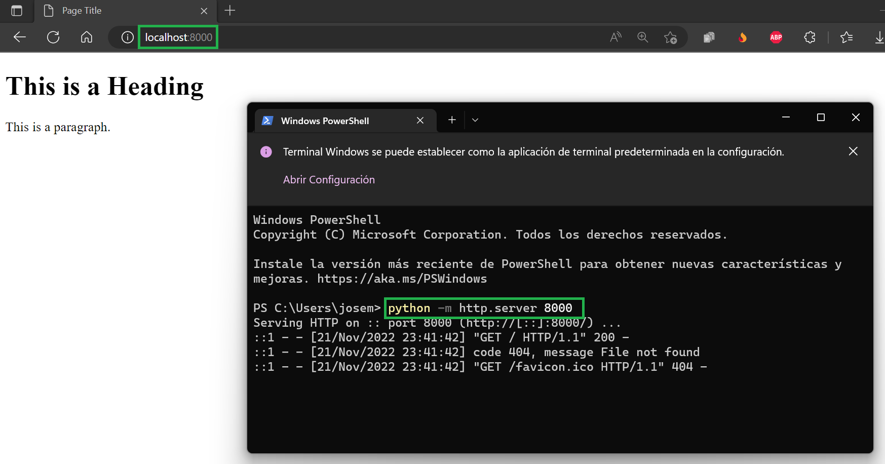
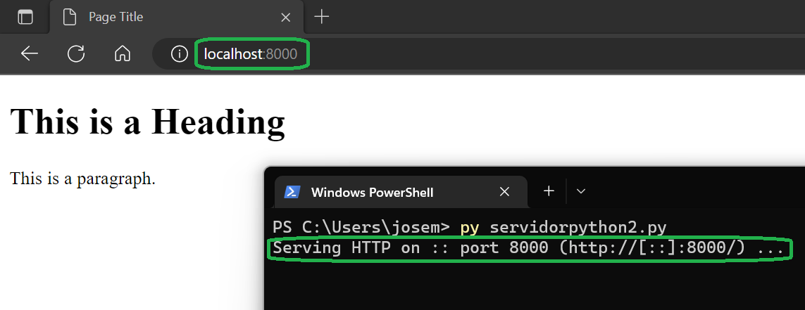

# Práctica servidor web

### Simple web server

```python
python -m http.server 8000
```


### HTTP server
##### Archivo descargado desde este [repositorio GitHub](https://github.com/python/cpython/blob/main/Lib/http/server.py)

