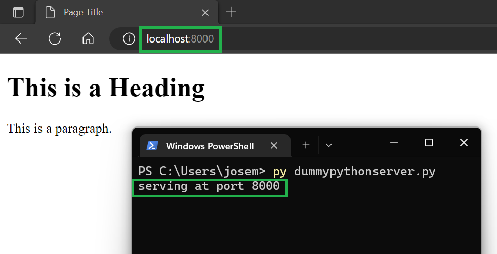

# Práctica servidor web

## Simple web server

```python
python -m http.server 8000
```


## HTTP server
#### Archivo descargado desde este [repositorio GitHub](https://github.com/python/cpython/blob/main/Lib/http/server.py)


## Dummy web server
#### Archivo descargado desde este [repositorio GitHub](https://gist.github.com/kabinpokhrel/6fd1275603e9d5f1e284be717cbd1bff)

